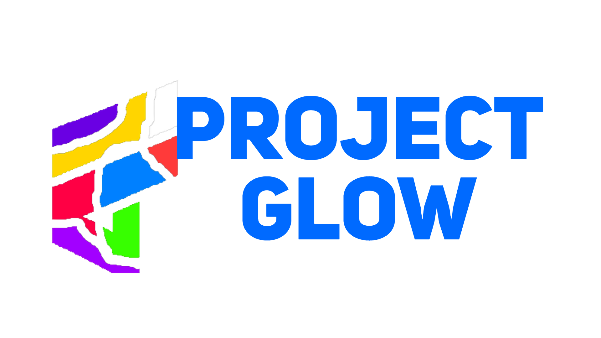

# Project Glow


[](https://discord.gg/bZJYdBXGjr)
[](https://github.com/Glowstik-YT/projglow)
[](https://github.com/Glowstik-YT/projglow)
[](LICENSE)
[](https://github.com/Glowstik-YT/projglow/issues)
[](https://github.com/Glowstik-YT/projglow/pulls)

Greetings, I see you have stumbled upon project glow. Project glow is an open source bot worked on by many people to create a 
good and safe moderation bot for all. Adding to the bot is simple!

First create a fork of the bot by clicking on the fork button in the top right coner.

Then, create a clone by installing [git](https://git-scm.com/) into your pc. After this is done and setup, run 
```
git clone https://github.com/Glowstik-YT/projglow
```
in whatever directory you wish to work on the bot. This will add all of the code into your pc.

Make sure to hook up your own bot token to test out the bot...

Once this is done and you have added changes you think can benifit the bot, go ahead and run
```
git add .
```
in the directory the bot is located in.

After this run
```
git commit -m "put what ever work you did here"
```
once this is done you have on last step to do.

Lastly, run 
```
git push <Your repository url>
```
and then go to the github fork you created and click on the contribute button to create a pull request where I will be able to accept or deny the changes!
# CLA
Remember That When You Contribute You Agree To The [License](/LICENSE) And [CLA](/CLA.md)

# Communication

If you need support for the bot please join the [Project Glow Support Server](https://discord.gg/bpvrRDWEQV) if you want to chat with other devs join [Glowstiks Git Repo](https://discord.gg/hJDsAVkkuU)
